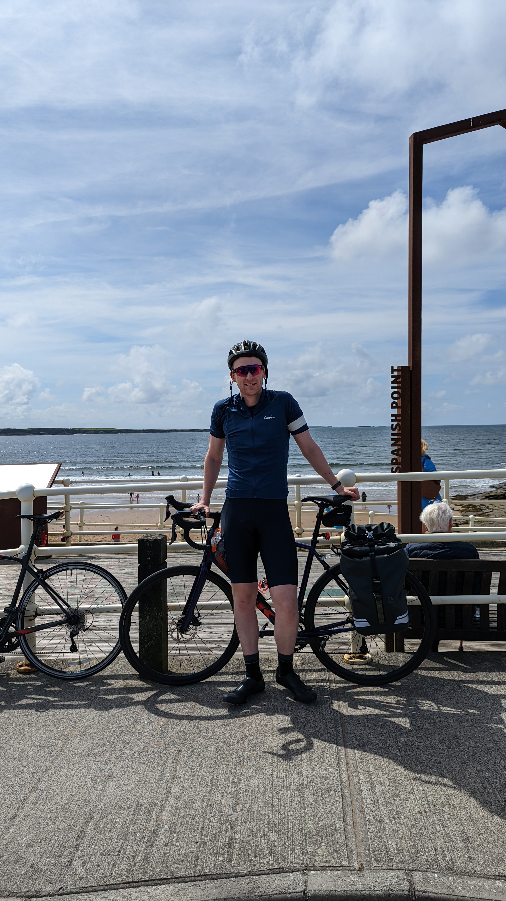
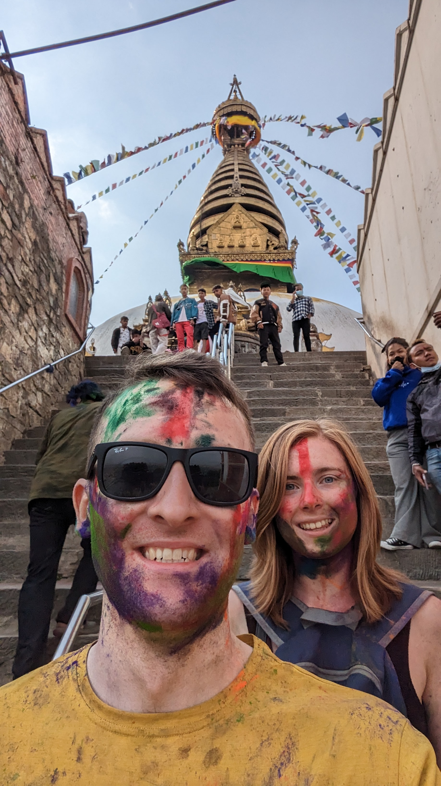

# 👋 I'm Eoin

    
    

    
    

Replace image1.jpg, image2.jpg, image3.jpg, and image4.jpg with the URLs or relative paths to your own images. Adjust the width attribute as needed to control the size of the images. The padding-right and padding-left styles create spacing between the columns, and the margin-top style adds some vertical spacing between the rows.

I'm an accomplished and innovative Machine Learning Engineer with a passion for developing and delivering state-of-the-art deep learning models. I have a proven track record of success in training computer vision systems and deploying models on edge devices.

## 💼 Career Summary

I have achieved significant milestones throughout my career, including:

- Delivering home surveillance object detection models for edge devices, enhancing security by accurately detecting people and animals in everyday settings.
- Training computer vision systems to detect quality issues on Jaguar Land Rover vehicles, resulting in a significant increase in accuracy compared to existing processes.
- Leading the development and delivery of lightweight Multi-Object Detector (MOD) networks with improved metrics like mean Average Precision and max F1 score.
- Driving the adoption of coding standards and implementing CI/CD practices to ensure code quality and reduce regression risks.
- Leading the consolidation of multiple network training repositories into a single python package, resulting in codebase size reduction and improved customer experience.

## ⚙️ Experience

### Machine Learning Engineer | Xperi / Perceive.io
#### October 2019 - Present | Limerick, Ireland

- Designed and trained generations of lightweight Multi-Object Detector (MOD) networks for home surveillance on edge devices, continuously improving key metrics using PyTorch and PyTorch Lightning framework.
- Conducted experiments to optimize network architecture, data augmentation, and optimization changes, integrating successful improvements into the MOD codebase.
- Spearheaded the establishment of team coding standards, including CI/CD stages for regular code linting and testing, ensuring better code quality and reducing regression risks.
- Led the delivery of training code as part of a Software Development Kit (SDK), streamlining the process for customers to train multiple networks using a single python package.
- Facilitated bi-weekly retrospectives following AGILE best practices, driving process improvements and fostering efficient experimentation within the team.
- Collaborated with cross-functional teams across different time zones to coordinate data acquisition initiatives, network quality assessments, and timely delivery to customers.
- Led the design of datasets to address network biases, resulting in improved performance in low-light scenarios and extended functionality for home security cameras.

## 🌱 Skills

- Machine Learning
- Deep Learning
- Computer Vision
- Python
- PyTorch
- TensorFlow
- Data Processing
- Model Deployment

## 📫 How to reach me

You can connect with me on:

- [LinkedIn](https://www.linkedin.com/in/eoin-oconnell)
